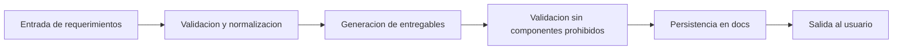

# Agent_AutoGen

Agente "Arquitecto de Solucion" construido con AutoGen AgentChat que convierte
requerimientos funcionales y no funcionales en una propuesta de arquitectura
implementable en la nube, sin usar componentes de entrada gestionados.

## Que hace el agente
- Interpreta requerimientos y restricciones.
- Genera los 7 entregables obligatorios (diagrama, componentes, flujos, ADRs, backlog,
  riesgos, costos).
- Valida que no aparezcan componentes prohibidos en la salida.
- Publica la documentacion en `docs/`.

## Flujo de trabajo


## Estructura del proyecto
- `src/` codigo del agente.
  - `src/agent/` orquestacion y herramientas.
  - `src/core/` schemas, generador, templates y validaciones.
  - `src/api/` capa API (placeholder si se expone HTTP).
  - `src/main.py` entrada CLI.
- `docs/` entregables y documentacion del proyecto.
- `test/` pruebas unitarias con pytest.
- `config/` configuracion externa (sin secretos).
- `data/` entradas (`requirements.json`) y salida del agente (architecture, adr, backlog, risk, cost).
- `monitoring/` helpers de observabilidad.

## Requisitos
- Python 3.10+

## Instalacion
```
python -m venv .venv
.venv\\Scripts\\Activate.ps1
pip install -r requirements.txt
```

En PowerShell si falla la activacion:
```
Set-ExecutionPolicy -Scope CurrentUser -ExecutionPolicy RemoteSigned
```

En macOS/Linux:
```
python3 -m venv .venv
source .venv/bin/activate
pip install -r requirements.txt
```

## Uso
Generar documentos con el input en `data/requirements.json`:
```
python -m src.main
```

Usar otro archivo JSON de entrada:
```
python -m src.main --input path\\to\\requirements.json
```

Usar otro archivo de configuracion:
```
python -m src.main --config path\\to\\config.yml
```

Activar LLM desde configuracion:
- En `config/config.yml` establece `llm.enabled: true`
- Define variables de entorno segun el proveedor (`OPENAI_API_KEY` o `AZURE_OPENAI_API_KEY`)
- Si usas Azure, completa `llm.azure.endpoint` y `llm.azure.deployment_name`

La salida se genera dentro de `data/`:
- `data/architecture/solution-proposal.md`
- `data/adr/`
- `data/backlog/backlog.csv`
- `data/risk/risk-register.md`
- `data/cost/cost-estimate.xlsx` (Excel: estimacion + hoja opcional con precios por scraping)

Para incluir precios de nube en el Excel, indica el proveedor en `data/requirements.json` (`cloud_provider`: `AWS`, `Azure` o `GCP`) o en `config/config.yml` (`cost.scrape_provider`: `azure`, `aws`, `gcp`). Se hace web scraping a las paginas oficiales de precios; si no se obtienen datos, se rellenan valores de referencia.

## Ejemplo de uso
1) Edita `data/requirements.json` con tus requerimientos.
2) Ejecuta:
```
python -m src.main
```
3) Revisa el entregable principal en `data/architecture/solution-proposal.md`.

## Formato del input
El archivo `data/requirements.json` acepta:
- `project_name`, `domain`, `cloud_provider`
- `functional_requirements`, `non_functional_requirements`, `constraints`
- `data_sources`, `resources`, `traffic_profile`, `regions`, `compliance`, `assumptions`

## Tests
```
pytest
```