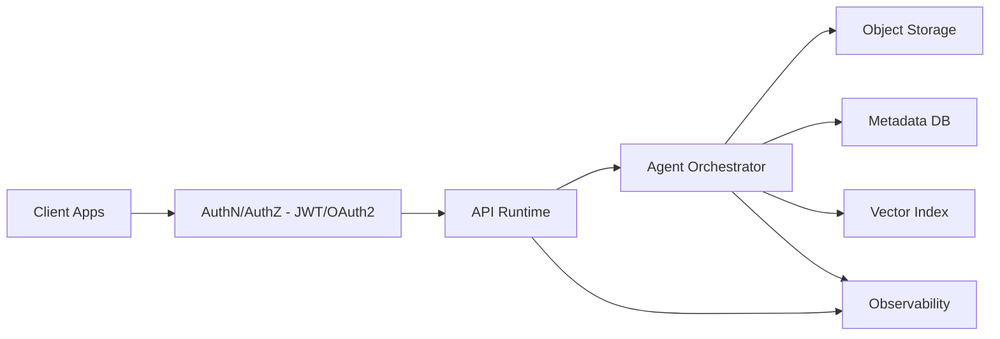

# Propuesta de arquitectura

## 1) Diagrama logico (Mermaid)

## 2) Componentes y responsabilidades

### Client Apps

- Proposito: Canal de entrada para solicitudes de arquitectura.

- Entradas: Requerimientos funcionales y no funcionales

- Salidas: Solicitud validada

- Dependencias: API Runtime

- Seguridad: TLS, Token JWT

### AuthN/AuthZ

- Proposito: Validar identidad y permisos en la capa API.

- Entradas: Credenciales, Tokens

- Salidas: Token firmado, Claims

- Dependencias: API Runtime

- Seguridad: Rotacion de llaves, Auditoria

### API Runtime

- Proposito: Exponer endpoints y orquestar el agente.

- Entradas: Solicitud autenticada

- Salidas: Respuesta estructurada

- Dependencias: Agent Orchestrator, Observability

- Seguridad: Rate limit en aplicacion, Validacion

### Agent Orchestrator

- Proposito: Construir propuesta de arquitectura con entregables.

- Entradas: Requerimientos normalizados

- Salidas: Propuesta completa

- Dependencias: Object Storage, Metadata DB, Vector Index

- Seguridad: No exponer secretos, Trazabilidad

### Object Storage

- Proposito: Guardar documentos y artefactos.

- Entradas: Archivos y plantillas

- Salidas: Versiones de documentos

- Dependencias: 

- Seguridad: Cifrado en reposo, RBAC

### Metadata DB

- Proposito: Guardar metadatos y estados de ejecucion.

- Entradas: Metadatos

- Salidas: Consultas, Estados

- Dependencias: 

- Seguridad: RBAC, Backups

### Vector Index

- Proposito: Indexar contexto para recuperacion semantica.

- Entradas: Embeddings

- Salidas: Resultados de retrieval

- Dependencias: 

- Seguridad: Scope por tenant, TTL

### Observability

- Proposito: Logs, metricas y trazas del flujo.

- Entradas: Eventos, Metricas

- Salidas: Dashboards, Alertas

- Dependencias: 

- Seguridad: No PII, Redaccion

## 3) Flujos end-to-end

### Ingesta y generacion

- Pasos: Ingreso de requerimientos, Validacion y normalizacion, Orquestacion del agente, Generacion de entregables, Persistencia y respuesta, Observabilidad

- Errores: Reintento con backoff, Errores validacion 4xx, Errores internos 5xx

- Timeouts: Timeout por etapa, Cancelacion segura

- Idempotencia: Idempotency key por solicitud

- Fallback: Respuesta parcial con advertencias

- Happy path: Respuesta completa con 7 entregables

## 4) ADRs

### ADR-0001 - Arquitectura sin servicio de entrada gestionado

- Contexto: El alcance prohibe componentes de entrada API gestionados.

- Opciones: Servicio gestionado de entrada API, Control en runtime, Reverse proxy

- Decision: Usar controles en la capa de aplicacion y red.

- Consecuencias: La API implementa autenticacion, autorizacion y rate limit., Se debe observar trafico directamente en runtime.

## 5) Backlog tecnico

### BL-001 - Implementacion del agente

- Historia: Crear generador de entregables y validaciones sin servicio gestionado de entrada.

- Prioridad: P0

- Criterios de aceptacion: Genera 7 entregables requeridos, Cumple restricciones de componentes

- Definition of done: Tests unitarios verdes, Documentacion actualizada

### BL-002 - Observabilidad

- Historia: Agregar logs y metricas por etapa.

- Prioridad: P1

- Criterios de aceptacion: Incluye request_id y tiempos por etapa

- Definition of done: Metricas en monitoring, Trazas activas

## 6) Riesgos, mitigaciones y supuestos

### R-001

- Riesgo: Sobrecosto por uso de LLM y almacenamiento.

- Impacto: Alto

- Mitigacion: Limites de cuota y cache de resultados.

- Supuestos: Volumen mensual moderado, Cache reutilizable

### R-002

- Riesgo: Calidad variable en entregables.

- Impacto: Medio

- Mitigacion: Validaciones y revisiones automatizadas.

- Supuestos: Plantillas estables, Requerimientos claros

## 7) Estimacion de costos

- Rango bajo: USD 300
- Rango medio: USD 1500
- Rango alto: USD 5000
- Drivers: Tokens LLM, Storage, Compute, Traffic
- Supuestos de volumen: 100-500 solicitudes/mes, Documentos medianos, Retencion 30 dias
